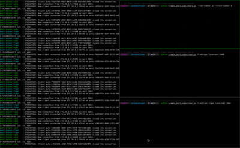

#  Simulation of a Fleet of Vehicules Publishing Sensor Data using the MQTT Protocol



## 1. Start the brokers

```bash
docker compose up
```

## 2. Create publishers

Publishers can be vans or trucks.

```bash
python create_mqtt_publishers.py --van-number 2 --truck-number 0
```

## 3. Create subscribers

```bash
python create_mqtt_subscriber.py fleet/gps localhost 1883

python create_mqtt_subscriber.py fleet/van-2/cargo-temp localhost 1884
```

## Brokers

Fleet broker:

- name: fleet
- host: localhost
- port: 1883

Vans broker:

- name: vans
- host: localhost
- port: 1884

Trucks broker:

- name: trucks
- host: localhost
- port: 1885

## Topics

- fleet/data
- fleet/gps
- fleet/{id}
- fleet/{id}/gps
- fleet/{id}/ecu
- fleet/{id}/cargo-temp
- fleet/{id}/trailer-pressure
